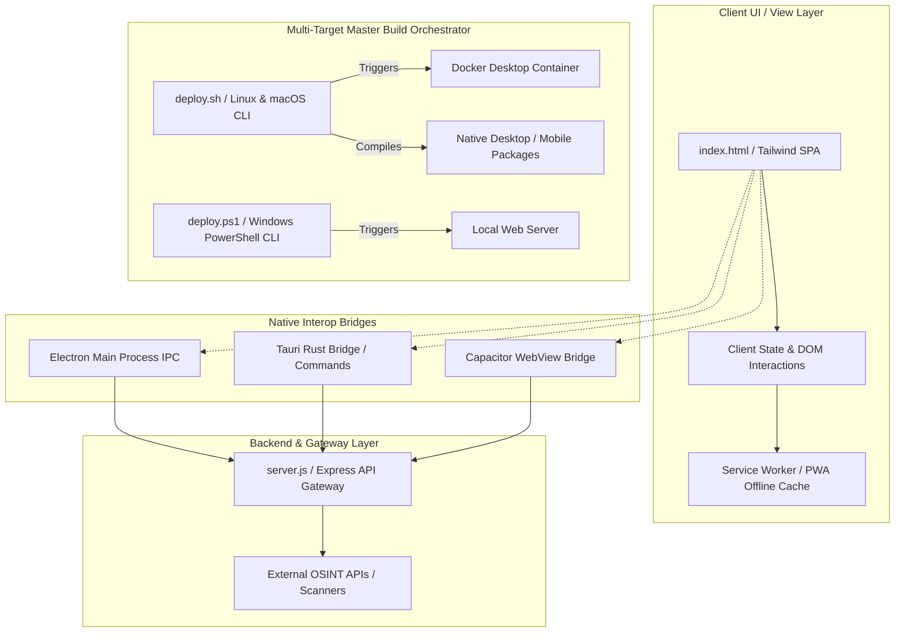

# ⚡ JIGSI KARIA TERMINATOR v4.0

[](https://github.com/jigsi-karia/terminator/actions/workflows/build-windows.yml)
[](https://github.com/jigsi-karia/terminator/actions/workflows/build-macos.yml)
[](https://github.com/jigsi-karia/terminator/actions/workflows/build-linux.yml)
[](https://github.com/jigsi-karia/terminator/actions/workflows/build-android.yml)
[](https://opensource.org/licenses/MIT)
[](#)

## 📖 Executive Overview & Key Features

**Jigsi Karia Terminator v4.0** is an enterprise-grade multi-platform Cyber OSINT Gateway and Hacker Scanner. It orchestrates over 300 tools and services into a unified, high-performance matrix. Architected for speed, flexibility, and extensive platform coverage, it allows security researchers, defensive analysts, and penetration testers to seamlessly switch between deep native integration (Tauri Rust / Electron) and lightweight web delivery (Capacitor / Express).

### Key Features:
- **Unified Master CLI:** Intelligent orchestration via `deploy.ps1` (Windows) and `deploy.sh` (macOS/Linux) with environment verification.
- **True Multi-Platform Native Architecture:** Deploy via Tauri (Rust), Electron (Node.js), Capacitor (Android), Docker, or Express.
- **Expansive Tool Suite:** Interactive access to OSINT frameworks, DNS intel, Web Scanners, Forensics, Dark Web trackers, and Cloud DevOps analysis.
- **Enterprise Ready Packaging:** CI/CD ready workflows generating native installers for zero-friction distribution.

---

## 🏗️ System Architecture



---

## 🚀 Quickstart Guide by OS

The orchestrator scripts automatically detect your environment, install missing dependencies, and launch the interactive CLI.

### 🪟 Windows (PowerShell)
```powershell
# Open PowerShell as Administrator
Set-ExecutionPolicy Unrestricted -Scope Process
# Run the Master Deployment CLI
.\deploy.ps1
```
*(Select from Dev Mode, Electron, Tauri, Capacitor, Docker, or Enterprise Packaging)*

### 🍏 macOS (Homebrew)
```bash
# Install dependencies via Homebrew
brew install node rust docker
# Make script executable and run
chmod +x deploy.sh
./deploy.sh
```

### 🐧 Linux (Bash / APT)
```bash
# Install dependencies (Ubuntu/Debian example)
sudo apt-get update && sudo apt-get install -y curl build-essential docker.io
curl -fsSL https://deb.nodesource.com/setup_20.x | sudo -E bash -
sudo apt-get install -y nodejs
# Execute orchestrator
chmod +x deploy.sh
./deploy.sh
```

### 📱 Android (Android Studio / Gradle)
```bash
# Ensure Android SDK / adb is configured
# From the deployment CLI (deploy.sh or deploy.ps1), select Option [4]
# Or run manually:
npx cap run android
```

---

## 🔨 Build Commands

The project uses **Vite** for web builds and **electron-builder** for desktop packaging. All
Electron main-process code is CommonJS (`require`), and static web assets live in the `public/`
folder and are compiled into `dist/`.

```bash
# Install dependencies
npm install

# Run the Vite dev server
npm run dev

# Build the web application (outputs to dist/)
npm run build

# Launch the Electron desktop app
npm start

# Create desktop installers per platform
npm run build:win       # Windows: NSIS installer + portable .exe
npm run build:mac       # macOS: ad-hoc signed .dmg + .zip (x64 + arm64)
npm run build:linux     # Linux: AppImage + .deb + .rpm

# Android (requires Android Studio / SDK)
npm run build:android   # Sync Capacitor and open Android Studio

# Run electron-builder directly
npm run dist
```

### GitHub Actions Workflows

| Workflow | Triggers | Produces |
| :--- | :--- | :--- |
| `build-windows.yml` | push, PR, tags | NSIS installer `.exe` + portable `.exe` |
| `build-macos.yml` | push, PR, tags | `.dmg` + `.zip` (x64, arm64, ad-hoc signed) |
| `build-linux.yml` | push, PR, tags | `.AppImage` + `.deb` + `.rpm` |
| `build-android.yml` | push, PR, tags | Signed release `.apk` (Android 8.0+) |
| `docker-publish.yml` | push, PR, tags | GHCR Docker image |

Artifacts are uploaded to GitHub Releases automatically on `v*` tag pushes.

---

## 📦 Output File Formats Matrix

| Platform | Engine / Target | Format | Description |
| :--- | :--- | :--- | :--- |
| **Windows** | NSIS / Electron / Tauri | `.exe`, `.msi` | Standard standalone installers with Registry & Uninstaller config. |
| **macOS** | Native / Electron / Tauri | `.dmg`, `.pkg` | Drag-and-drop Apple disk images and signed Installer Packages. |
| **Linux** | Native / Shell | `.AppImage`, `.deb`, `.rpm` | Portable AppImages, Debian packages, and RedHat packages. |
| **Android** | Capacitor / Gradle | `.apk`, `.aab` | Debug/Release Application Packages and Android App Bundles. |
| **Cloud/Web** | Docker / Node.js | Container Image | Standard OCI Docker Image for Kubernetes or Cloud Run. |

---

## 🔐 Security, Code Signing & Production Release Workflow

Before releasing enterprise artifacts to production, strictly adhere to the following code-signing and notarization workflows.

### 1. Windows (Authenticode Code Signing)
Sign your `.exe` or `.msi` installers using the Windows SDK `signtool` to bypass SmartScreen warnings.
```powershell
signtool sign /f .\certs\EnterpriseCert.pfx /p "YourSecurePassword" /tr http://timestamp.digicert.com /td sha256 /fd sha256 .\dist\JigsiKariaSetup.exe
```

### 2. macOS (Gatekeeper Notarization)
Apple requires all `.dmg` and `.pkg` files to be code-signed and notarized for Catalina and newer.
```bash
# Sign the Application Bundle
codesign --deep --force --verify --verbose --sign "Developer ID Application: Jigsi Karia (TEAMID123)" JigsiKariaTerminator.app

# Submit for Apple Notarization
xcrun notarytool submit jigsi-karia-terminator.dmg --apple-id "admin@jigsikaria.com" --password "app-specific-pwd" --team-id "TEAMID123" --wait

# Staple the ticket to the DMG
xcrun stapler staple jigsi-karia-terminator.dmg
```

### 3. Linux (GPG Signature Signing)
Sign `.rpm` and `.deb` packages using a GPG private key.
```bash
# Export public key for distribution
gpg --armor --export admin@jigsikaria.com > jigsi-karia.pub

# Sign Debian packages
dpkg-sig --sign builder jigsi-karia_4.0.0_amd64.deb

# Sign RPM packages (ensure %_gpg_name is set in ~/.rpmmacros)
rpm --addsign jigsi-karia-4.0.0.x86_64.rpm
```

### Release Pipeline Checklist
- [ ] Version bump `package.json`, `tauri.conf.json`, `capacitor.config.json`
- [ ] Ensure all local tests pass (`npm run test`)
- [ ] Run **[6] Enterprise Production Packaging** via Master CLI.
- [ ] Apply Code Signatures & Notarization (as detailed above).
- [ ] Publish artifacts to GitHub Releases / Enterprise Artifact Registry.
